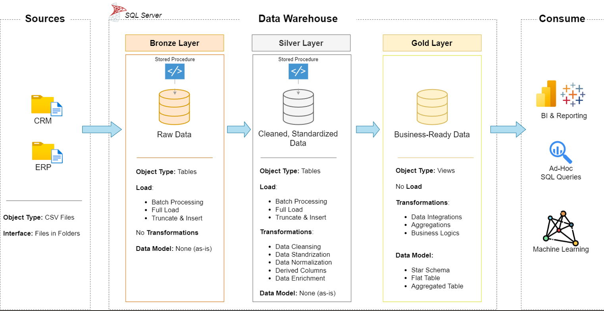

# SQL Data Warehouse Project

## Introduction
Welcome to the **SQL Data Warehouse  Project** repository! 🚀  
This project demonstrates a comprehensive data warehousing solution using and SQL Server, from building a data warehouse to generating actionable insights. It is designed as a portfolio project, highlighting industry best practices in data engineering and analytics.


## 📖 Project Overview

This project involves:

1. **Data Architecture**: Designing a Modern Data Warehouse Using Medallion Architecture **Bronze**, **Silver**, and **Gold** layers.
2. **ETL Pipelines**: Extracting, transforming, and loading data from source systems into the warehouse.
3. **Data Modeling**: Developing fact and dimension tables optimized for analytical queries.
4. **Analytics & Reporting**: Creating SQL-based reports and dashboards for actionable insights.

🎯 This repository is an great resource to showcase expertise in:
- SQL Development
- Data Architect
- Data Engineering  
- ETL Pipeline Developer  
- Data Modeling  
- Data Analytics  

---

## 🏗️ Data Architecture

The data architecture used in this project is the Medallion Architecture with **Bronze**, **Silver**, and **Gold** layers:

1. **Bronze Layer**: Stores raw data as-it-is from the source systems. Data is ingested from CSV Files into SQL Server Database.
2. **Silver Layer**: This layer includes data cleaning, standardization,transformation, and normalization processes to prepare the data for analysis.
3. **Gold Layer**: Houses business-ready data which is modeled into a star schema required for reporting and analytics.

---

## 🛠️ Tools used:

- **[SQL Server Express](https://www.microsoft.com/en-us/sql-server/sql-server-downloads):** Lightweight server for hosting your SQL database.
- **[SQL Server Management Studio (SSMS)](https://learn.microsoft.com/en-us/sql/ssms/download-sql-server-management-studio-ssms?view=sql-server-ver16):** GUI for managing and interacting with databases.
- **[DrawIO](https://www.drawio.com/):** Design data architecture, models, flows, and diagrams.

---

## 🚀 Implementation steps:

### Building the Data Warehouse (Data Engineering)

#### Objective
These steps were followed to implement the project: 

- **Data Sources**: Import data from two source systems (ERP and CRM) provided as CSV files.
- **Data Quality**: Cleanse and resolve data quality issues prior to analysis.
- **Integration**: Combine both sources into a single, user-friendly data model designed for analytical queries.
- **Scope**: Focus on the latest dataset only; historization of data is not required.
- **Documentation**: Provide clear documentation of the data model to support both business stakeholders and analytics teams.

---

## 📂 Repository Structure
```
SQL-Data-Warehouse-Project/
│
├── datasets/                           # Raw datasets used in the project (ERP and CRM data)
│
├── docs/                               # Project documentation and architecture details
│   ├── etl.drawio                      # Draw.io file shows all different techniquies and methods of ETL
│   ├── data_architecture.drawio        # Draw.io file shows the project's architecture
│   ├── data_catalog.md                 # Catalog of datasets, including field descriptions and metadata
│   ├── data_flow.drawio                # Draw.io file for the data flow diagram
│   ├── data_models.drawio              # Draw.io file for data models (star schema)
│   ├── naming-conventions.md           # Consistent naming guidelines for tables, columns, and files
│
├── scripts/                            # SQL scripts for ETL and transformations
│   ├── bronze/                         # Scripts for extracting and loading raw data
│   ├── silver/                         # Scripts for cleaning and transforming data
│   ├── gold/                           # Scripts for creating analytical models
│
├── tests/                              # Test scripts and quality files
│
├── README.md                           # Project overview and instructions                          
├── .gitignore                          # Files and directories to be ignored by Git
└── requirements.txt                    # Dependencies and requirements for the project
```
---

## Project Status:

#### COMPLETE

---
## 🚀 Going forward(TODO): 
### BI: Analytics & Reporting (Data Analysis)

#### Objective
Develop SQL-based analytics to deliver detailed insights into:
- **Customer Behavior**
- **Product Performance**
- **Sales Trends**

These insights empower stakeholders with key business metrics, enabling strategic decision-making.  

For more details, refer to [docs/requirements.md](docs/requirements.md).

---

## 🌟 About Me

Warm greetings to you! My name is **Masine Donald**. I am a **recent graduate** from the **University of Johannesburg**. I hold a bachelor of science degree, majoring **Applied Mathematics and Computer Science**.

Feel free to connect with me on:

[](https://www.linkedin.com/in/donald-masine-17a430270/)
